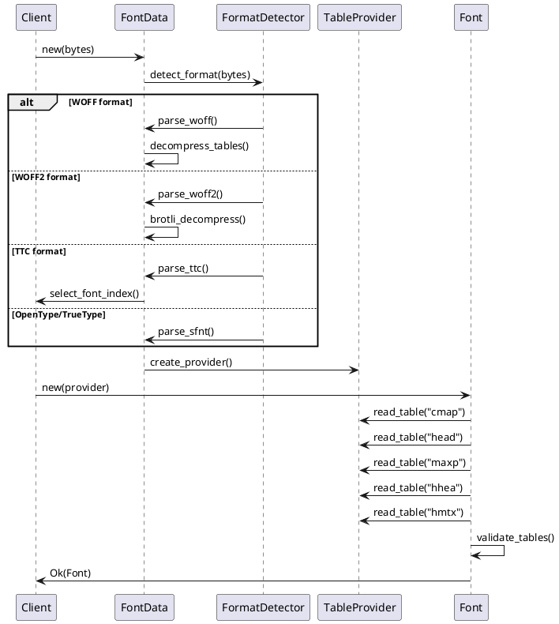
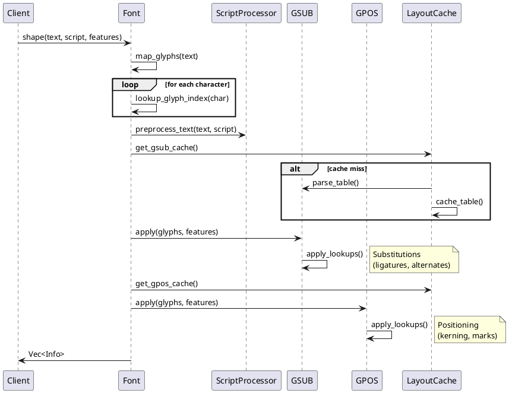
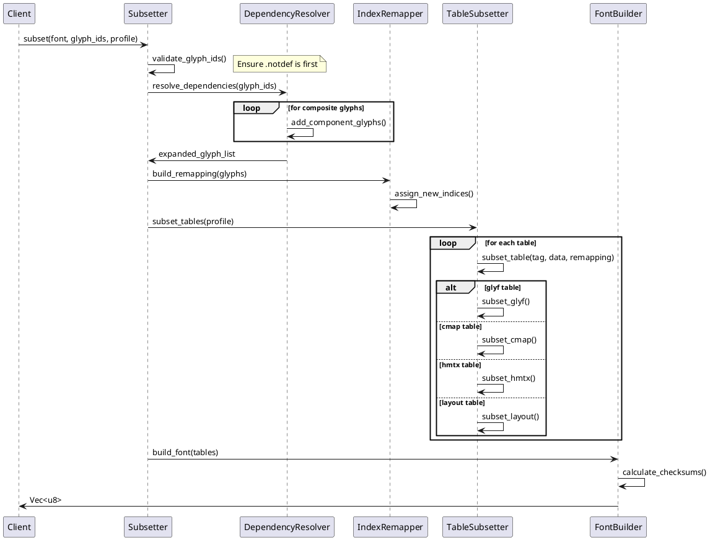
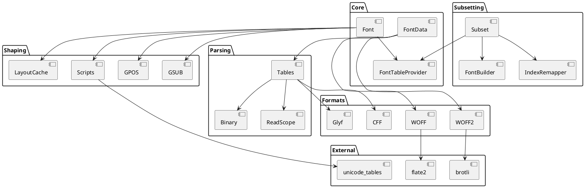

<!-- AUTO-GENERATED; DO NOT EDIT -->
# Allsorts — Reverse-Engineered Guide

## 1) What this project does (overview)

Allsorts is a comprehensive font processing library written in Rust that provides parsing, shaping, and subsetting capabilities for OpenType, TrueType, WOFF, and WOFF2 fonts. Originally extracted from the Prince HTML/CSS-to-PDF converter, it serves as a complete font handling solution with particular strength in complex script support (Arabic, Indic scripts, Southeast Asian scripts) and efficient font subsetting for web and PDF embedding. Recent enhancements include advanced subsetting with glyph ID mapping, CID font support for PDFs, composite glyph reference fixing, and a fluent builder API for subsetting operations.

**Tech Stack & Runtime Assumptions:**
- Language: Rust (MSRV 1.83.0)
- Architecture: Zero-copy parsing with lifetime-based memory management
- Dependencies: Minimal external deps (brotli for WOFF2, flate2 for compression, unicode tables)
- Platform: Cross-platform (Linux, macOS, Windows, FreeBSD)
- Binary format: Little-endian and big-endian aware
- Memory model: Stack-allocated parsing contexts with borrowed data

## 2) Feature Catalog

### Feature 2.1: Font Parsing
**What & Why:** Parse font files from various formats into a unified representation for processing. Supports TrueType, OpenType, WOFF, and WOFF2 formats with zero-copy parsing for efficiency.

**How (high level):**
```
Raw bytes → Format detection → Table directory parsing → Lazy table loading → Font object
```

**Inputs/Outputs:**
- Input: Raw font file bytes (`&[u8]`)
- Output: `Font<T>` object with table access methods

**Capabilities:**
- [2.1.1 Format Detection](#311-format-detection)
- [2.1.2 Table Directory Parsing](#312-table-directory-parsing)
- [2.1.3 WOFF Decompression](#313-woff-decompression)
- [2.1.4 WOFF2 Brotli Decompression](#314-woff2-brotli-decompression)
- [2.1.5 TTC Font Collection Support](#315-ttc-font-collection-support)

### Feature 2.2: Text Shaping
**What & Why:** Transform Unicode text into positioned glyphs using OpenType layout features. Essential for correct rendering of complex scripts and typography.

**How (high level):**
```
Unicode text → Script detection → Preprocessing → Glyph mapping → GSUB → GPOS → Shaped glyphs
```

**Inputs/Outputs:**
- Input: Unicode string, script tag, language tag, feature list
- Output: `Vec<Info>` with positioned glyphs

**Capabilities:**
- [2.2.1 Unicode to Glyph Mapping](#321-unicode-to-glyph-mapping)
- [2.2.2 Script-Specific Preprocessing](#322-script-specific-preprocessing)
- [2.2.3 GSUB Application](#323-gsub-application)
- [2.2.4 GPOS Application](#324-gpos-application)
- [2.2.5 Complex Script Support](#325-complex-script-support)

### Feature 2.3: Font Subsetting
**What & Why:** Extract a subset of glyphs from a font to create smaller files for web/PDF embedding while maintaining font integrity.

**How (high level):**
```
Font + glyph list → Dependency resolution → Index remapping → Table subsetting → New font
```

**Inputs/Outputs:**
- Input: Font provider, glyph IDs, subset profile, cmap target
- Output: Subset font bytes (`Vec<u8>`)

**Capabilities:**
- [2.3.1 Glyph Dependency Resolution](#331-glyph-dependency-resolution)
- [2.3.2 Index Remapping](#332-index-remapping)
- [2.3.3 Table-Specific Subsetting](#333-table-specific-subsetting)
- [2.3.4 Profile-Based Subsetting](#334-profile-based-subsetting)
- [2.3.5 CFF to CID Conversion](#335-cff-to-cid-conversion)

📚 **[Comprehensive Subsetting Guide](docs/subsetting.md)** - Detailed documentation covering all subsetting APIs, CID font support, composite glyph handling, and best practices.

### Feature 2.4: Glyph Outlines
**What & Why:** Extract vector path data from glyphs for rendering or analysis. Supports both TrueType and PostScript outline formats.

**How (high level):**
```
Glyph ID → Table lookup → Outline parsing → Path commands → Outline sink
```

**Inputs/Outputs:**
- Input: Glyph ID, outline builder
- Output: Path commands via OutlineBuilder trait

**Capabilities:**
- [2.4.1 TrueType Outline Extraction](#341-truetype-outline-extraction)
- [2.4.2 CFF CharString Interpretation](#342-cff-charstring-interpretation)
- [2.4.3 Composite Glyph Resolution](#343-composite-glyph-resolution)
- [2.4.4 Variable Font Interpolation](#344-variable-font-interpolation)

### Feature 2.5: Color & Bitmap Fonts
**What & Why:** Support modern color fonts and emoji through various bitmap and vector color formats.

**How (high level):**
```
Glyph ID + size → Table selection → Image extraction → Bitmap/SVG data
```

**Inputs/Outputs:**
- Input: Glyph ID, target pixel size, bit depth
- Output: `BitmapGlyph` with image data

**Capabilities:**
- [2.5.1 CBDT/CBLC Bitmap Extraction](#351-cbdtcblc-bitmap-extraction)
- [2.5.2 sbix Apple Bitmap Support](#352-sbix-apple-bitmap-support)
- [2.5.3 SVG Glyph Support](#353-svg-glyph-support)
- [2.5.4 COLR/CPAL Layer Composition](#354-colrcpal-layer-composition)

### Feature 2.6: Variable Fonts
**What & Why:** Support OpenType Font Variations for dynamic font adjustment along design axes.

**How (high level):**
```
Variation coordinates → Axis normalization → Delta calculation → Glyph interpolation
```

**Inputs/Outputs:**
- Input: Variation tuple (axis values)
- Output: Interpolated glyph outlines/metrics

**Capabilities:**
- [2.6.1 Axis Definition Parsing](#361-axis-definition-parsing)
- [2.6.2 Instance Interpolation](#362-instance-interpolation)
- [2.6.3 Glyph Variation Application](#363-glyph-variation-application)
- [2.6.4 Metric Variation Support](#364-metric-variation-support)

## 3) Technical Capabilities (portable spec)

### 3.1 Font Parsing Capabilities

#### 3.1.1 Format Detection
**Role:** Identify font format from magic bytes and structure

**Location:** `src/font_data.rs::FontData::new` (lines 30-90)

**Signature:**
```rust
pub fn new(bytes: &'a [u8]) -> Result<FontData<'a>, ParseError>
```

**Core algorithm:**
```rust
// Check magic bytes for format detection
match first_4_bytes {
    b"wOFF" => parse_woff(bytes),
    b"wOF2" => parse_woff2(bytes),
    b"ttcf" => parse_ttc(bytes),
    _ => parse_sfnt(bytes)  // TrueType/OpenType
}
```

**Data access:** Read-only on input bytes

**External refs:** None

**Error handling:** Returns ParseError on invalid format

**Portability notes:** 
- Implement magic byte checking in target language
- Handle both big-endian (TTF) and little-endian byte orders
- Support streaming or memory-mapped file access

#### 3.1.2 Table Directory Parsing
**Role:** Parse font table directory to locate individual tables

**Location:** `src/tables.rs::OffsetTable::read_table` (lines 466-490)

**Signature:**
```rust
pub fn read_table(&self, tag: u32) -> Option<Result<ReadScope<'a>, ParseError>>
```

**Core algorithm:**
```rust
// Binary search through sorted table records
let record = binary_search(table_records, tag);
if let Some(record) = record {
    // Return scope for table data at offset
    return Some(ReadScope::new(&data[record.offset..record.offset + record.length]));
}
```

**Data access:** Read-only table lookups

**External refs:** ReadScope for safe parsing

**Error handling:** Option type for missing tables

**Portability notes:**
- Implement binary search for O(log n) table lookup
- Validate table checksums if required
- Handle table padding to 4-byte boundaries

#### 3.1.3 WOFF Decompression
**Role:** Decompress WOFF table data using zlib

**Location:** `src/woff.rs::TableDirectoryEntry::read_table` (lines 180-200)

**Signature:**
```rust
pub fn read_table(&self, data: &[u8]) -> Result<Vec<u8>, ParseError>
```

**Core algorithm:**
```rust
if compressed_length < original_length {
    // Decompress using zlib
    let mut decoder = ZlibDecoder::new(&compressed_data);
    decoder.read_exact(&mut decompressed)?;
} else {
    // Use uncompressed data
    decompressed = compressed_data.to_vec();
}
```

**Data access:** Read compressed data, write decompressed

**External refs:** flate2 for zlib decompression

**Error handling:** Validates decompressed size matches expected

**Portability notes:**
- Use platform zlib or pure implementation
- Validate decompressed size exactly matches original_length
- Handle both compressed and uncompressed tables

#### 3.1.4 WOFF2 Brotli Decompression
**Role:** Decompress WOFF2 data using Brotli algorithm

**Location:** `src/woff2.rs::Woff2Font::table_data_block_scope` (lines 160-180)

**Signature:**
```rust
fn table_data_block_scope(&self) -> Result<ReadScope<'a>, ParseError>
```

**Core algorithm:**
```rust
// Decompress entire table data block with Brotli
let mut decompressed = vec![0u8; uncompressed_size];
brotli::BrotliDecompress(&compressed_data, &mut decompressed)?;
// Transform certain tables (glyf, loca) from WOFF2 format
apply_table_transforms(&mut decompressed, table_directory);
```

**Data access:** Bulk decompression of all tables

**External refs:** brotli-decompressor crate

**Error handling:** Validates Brotli decompression success

**Portability notes:**
- Implement or link Brotli decompressor
- Handle WOFF2-specific table transformations
- Support stream reconstruction for transformed glyf/loca

#### 3.1.5 TTC Font Collection Support
**Role:** Access individual fonts within TrueType Collections

**Location:** `src/tables.rs::TTCHeader::table_provider` (lines 310-330)

**Signature:**
```rust
pub fn table_provider(&self, index: usize) -> Result<OffsetTableFontProvider<'a>, ParseError>
```

**Core algorithm:**
```rust
// Read offset table for requested font index
let offset = ttc_header.offset_tables[index];
let offset_table = OffsetTable::read_at(data, offset)?;
// Return provider for this specific font
OffsetTableFontProvider::new(offset_table, data)
```

**Data access:** Index into font collection

**External refs:** None

**Error handling:** Bounds checking on font index

**Portability notes:**
- Validate font index within collection bounds
- Each font has independent table directory
- Share common tables between fonts when possible

### 3.2 Text Shaping Capabilities

#### 3.2.1 Unicode to Glyph Mapping
**Role:** Map Unicode codepoints to font glyph indices

**Location:** `src/font.rs::Font::lookup_glyph_index` (lines 310-380)

**Signature:**
```rust
pub fn lookup_glyph_index(&mut self, ch: char, match_presentation: MatchingPresentation, variation_selector: Option<VariationSelector>) -> (u16, VariationSelector)
```

**Core algorithm:**
```rust
// Check cache first
if let Some(cached) = glyph_cache.get(ch) {
    return cached;
}
// Map through appropriate encoding
let glyph_id = match encoding {
    Unicode => cmap_subtable.map_glyph(ch as u32),
    Symbol => map_symbol(ch),
    AppleRoman => map_apple_roman(ch),
    Big5 => map_big5(ch),
};
// Apply variation selector if present
if let Some(vs) = variation_selector {
    glyph_id = apply_variation_selector(glyph_id, vs);
}
// Cache and return
glyph_cache.insert(ch, glyph_id);
```

**Data access:** 
- Read: cmap table
- Write: glyph cache

**External refs:** Encoding conversion tables

**Error handling:** Returns .notdef (0) for missing glyphs

**Portability notes:**
- Implement caching for performance
- Support multiple cmap subtable formats (0, 2, 4, 6, 8, 10, 12, 13, 14)
- Handle platform-specific encodings

#### 3.2.2 Script-Specific Preprocessing
**Role:** Prepare text for shaping based on script requirements

**Location:** `src/scripts/mod.rs::preprocess_text` (lines 60-140)

**Signature:**
```rust
pub fn preprocess_text(s: &str, script: u32, options: &PreprocessingOptions) -> Cow<'_, str>
```

**Core algorithm:**
```rust
match script {
    ARAB | SYRC => {
        // Insert ZWNJ around punctuation
        insert_dotted_circles_for_broken_marks(text)
    }
    DEVA | BENG | GURU | /*...*/ => {
        // Reorder marks, handle syllable boundaries
        indic_preprocess(text)
    }
    THAI | LAO => {
        // Handle tone mark reordering
        thai_lao_preprocess(text)
    }
    _ => Cow::Borrowed(text)  // No preprocessing
}
```

**Data access:** Read-only text analysis

**External refs:** Unicode property tables

**Error handling:** Safe Unicode handling

**Portability notes:**
- Implement script-specific preprocessing rules
- Handle malformed combining sequences
- Preserve string indices for mapping back

#### 3.2.3 GSUB Application
**Role:** Apply glyph substitution rules (ligatures, alternates, etc.)

**Location:** `src/gsub.rs::apply` (lines 1060-1180)

**Signature:**
```rust
pub fn apply(gsub_cache: &LayoutCache<GSUB>, glyphs: &mut Vec<RawGlyph<T>>, features: &Features) -> Result<(), ShapingError>
```

**Core algorithm:**
```rust
// Build feature lookup list
let lookups = collect_lookups_for_features(gsub_cache, features);

// Apply lookups in order
for lookup in lookups {
    let mut i = 0;
    while i < glyphs.len() {
        match apply_lookup_at_position(lookup, glyphs, i) {
            Applied => { /* start over at this position */ }
            NotApplied => i += 1,
        }
    }
}
```

**Data access:**
- Read: GSUB table lookups
- Write: glyph array modifications

**External refs:** Layout table cache

**Error handling:** Returns ShapingError on invalid lookups

**Portability notes:**
- Implement all GSUB lookup types (1-8)
- Handle contextual and chaining lookups
- Maintain glyph metadata through substitutions

#### 3.2.4 GPOS Application
**Role:** Apply glyph positioning adjustments

**Location:** `src/gpos.rs::apply` (lines 30-200)

**Signature:**
```rust
pub fn apply(gpos_cache: &LayoutCache<GPOS>, glyphs: &[RawGlyph<T>], kerning: bool, features: &Features) -> Result<Vec<Info>, ShapingError>
```

**Core algorithm:**
```rust
// Initialize positioning info
let mut infos = Info::init_from_glyphs(glyphs);

// Collect and sort lookups globally
let mut lookups = collect_lookups_for_features(gpos_cache, features);
lookups.sort_by_key(|l| l.index);

// Apply each lookup across all positions
for lookup in lookups {
    for i in 0..infos.len() {
        apply_lookup_at_position(lookup, &mut infos, i);
    }
}

// Apply kerning if requested
if kerning {
    apply_kerning(&mut infos);
}
```

**Data access:**
- Read: GPOS table lookups
- Write: positioning info array

**External refs:** Anchor point calculations

**Error handling:** Graceful handling of malformed lookups

**Portability notes:**
- Implement GPOS lookup types (1-9)
- Handle mark attachment and cursive connections
- Maintain cumulative positioning adjustments

#### 3.2.5 Complex Script Support
**Role:** Script-specific shaping logic for complex writing systems

**Location:** `src/scripts/arabic.rs::gsub_apply_arabic` (lines 90-300)

**Signature:**
```rust
pub fn gsub_apply_arabic(gsub: &LayoutCache<GSUB>, glyphs: &mut Vec<RawGlyph<T>>) -> Result<(), ShapingError>
```

**Core algorithm:**
```rust
// Phase 1: Analyze joining behavior
for glyph in glyphs {
    glyph.joining_type = get_joining_type(glyph.char);
}

// Phase 2: Apply positional forms
for i in 0..glyphs.len() {
    let form = determine_form(glyphs, i);  // Initial, Medial, Final, Isolated
    apply_feature(form, &mut glyphs[i]);
}

// Phase 3: Apply standard features in order
for feature in ["rlig", "calt", "liga", "cswh", "mset"] {
    apply_feature_globally(feature, glyphs);
}
```

**Data access:** 
- Read: Arabic joining tables
- Write: glyph substitutions

**External refs:** Unicode Arabic properties

**Error handling:** Falls back to unshaped on error

**Portability notes:**
- Implement joining behavior analysis
- Apply features in correct order
- Handle right-to-left text direction

### 3.3 Font Subsetting Capabilities

#### 3.3.1 Glyph Dependency Resolution
**Role:** Find all glyphs required for subset including composites

**Location:** `src/tables/glyf/subset.rs::SubsetGlyf::new` (lines 20-100)

**Signature:**
```rust
pub fn new(glyf: &GlyfTable<'a>, glyph_ids: &[u16]) -> Result<SubsetGlyf<'a>, ParseError>
```

**Core algorithm:**
```rust
let mut to_process = glyph_ids.to_vec();
let mut processed = HashSet::new();

while let Some(glyph_id) = to_process.pop() {
    if processed.contains(&glyph_id) {
        continue;
    }
    
    let glyph = parse_glyph(glyph_id)?;
    if let CompositeGlyph(composite) = glyph {
        // Add component glyphs to process queue
        for component in composite.components {
            to_process.push(component.glyph_index);
        }
    }
    
    processed.insert(glyph_id);
    subset_glyphs.push(glyph);
}
```

**Data access:** 
- Read: glyf table
- Write: subset glyph list

**External refs:** Glyph parsing

**Error handling:** Propagates parsing errors

**Portability notes:**
- Implement recursive component resolution
- Handle nested composite glyphs
- Preserve component transformations

#### 3.3.2 Index Remapping
**Role:** Remap glyph indices to consecutive range

**Location:** `src/subset.rs::build_glyph_remapping` (lines 400-450)

**Signature:**
```rust
fn build_glyph_remapping(old_ids: &[u16]) -> (HashMap<u16, u16>, HashMap<u16, u16>)
```

**Core algorithm:**
```rust
let mut old_to_new = HashMap::new();
let mut new_to_old = HashMap::new();

// Assign consecutive new IDs
for (new_id, &old_id) in old_ids.iter().enumerate() {
    old_to_new.insert(old_id, new_id as u16);
    new_to_old.insert(new_id as u16, old_id);
}

// Update all references in tables
for table in tables_to_update {
    table.remap_glyph_ids(&old_to_new);
}
```

**Data access:**
- Read: Original glyph IDs
- Write: Mapping tables

**External refs:** None

**Error handling:** Assumes valid input IDs

**Portability notes:**
- Maintain bidirectional mapping
- Update all glyph references consistently
- Preserve .notdef at index 0

#### 3.3.3 Table-Specific Subsetting
**Role:** Subset individual tables based on glyph selection

**Location:** `src/subset.rs::subset_table` (lines 500-600)

**Signature:**
```rust
fn subset_table(tag: u32, data: &[u8], glyphs: &SubsetGlyphs) -> Result<Vec<u8>, SubsetError>
```

**Core algorithm:**
```rust
match tag {
    tag!(b"glyf") => subset_glyf(data, glyphs),
    tag!(b"loca") => rebuild_loca(glyphs),
    tag!(b"cmap") => subset_cmap(data, glyphs, target),
    tag!(b"hmtx") => subset_hmtx(data, glyphs),
    tag!(b"GSUB") | tag!(b"GPOS") => subset_layout_table(data, glyphs),
    tag!(b"name") => filter_name_table(data),
    _ => Ok(data.to_vec())  // Copy unchanged
}
```

**Data access:** Table-specific read/write

**External refs:** Table format specifications

**Error handling:** Table-specific validation

**Portability notes:**
- Implement format-specific subsetting
- Maintain table dependencies
- Update table checksums

#### 3.3.4 Profile-Based Subsetting
**Role:** Select tables based on target use case

**Location:** `src/subset.rs::SubsetProfile::get_tables` (lines 70-120)

**Signature:**
```rust
fn get_tables(&self) -> Vec<u32>
```

**Core algorithm:**
```rust
const PROFILE_PDF: &[u32] = &[
    tag!(b"cmap"), tag!(b"head"), tag!(b"cvt "),
    tag!(b"fpgm"), tag!(b"hhea"), tag!(b"hmtx"),
    tag!(b"maxp"), tag!(b"name"), tag!(b"post"),
    tag!(b"prep")
];

const PROFILE_WEB: &[u32] = &[
    /* PROFILE_PDF tables plus: */
    tag!(b"OS/2"), tag!(b"GPOS"), tag!(b"GSUB")
];

match profile {
    Pdf => PROFILE_PDF,
    Web => PROFILE_WEB,
    Custom(tables) => tables
}
```

**Data access:** Read-only table selection

**External refs:** None

**Error handling:** None required

**Portability notes:**
- Define profiles for target platforms
- Include required dependent tables
- Consider compression requirements

#### 3.3.5 CFF to CID Conversion
**Role:** Convert Type 1 CFF to CID-keyed for >255 glyphs

**Location:** `src/cff/subset.rs::convert_type1_to_cid` (lines 200-400)

**Signature:**
```rust
fn convert_type1_to_cid(cff: &CFF, glyphs: &[u16]) -> Result<CFF, SubsetError>
```

**Core algorithm:**
```rust
if glyphs.len() > 255 && cff.is_type1() {
    // Build CID structures
    let mut fd_select = FDSelect::new();
    let mut fd_array = FDArray::new();
    
    // Create single Font DICT
    fd_array.add(cff.font_dict.clone());
    
    // Map all glyphs to FD 0
    for glyph_id in glyphs {
        fd_select.set(glyph_id, 0);
    }
    
    // Update Top DICT
    top_dict.set_ros("Adobe", "Identity", 0);
    top_dict.fd_array_offset = fd_array.offset;
    top_dict.fd_select_offset = fd_select.offset;
}
```

**Data access:**
- Read: CFF structures
- Write: New CID structures

**External refs:** CFF specification

**Error handling:** Validates conversion success

**Portability notes:**
- Understand Type 1 vs CID-keyed differences
- Implement FDSelect and FDArray structures
- Update CharString subroutine calls

### 3.4 Glyph Outline Capabilities

#### 3.4.1 TrueType Outline Extraction
**Role:** Extract quadratic Bézier curves from TrueType glyphs

**Location:** `src/tables/glyf.rs::SimpleGlyph::outline` (lines 500-650)

**Signature:**
```rust
pub fn outline(&self, sink: &mut impl OutlineSink) -> Result<(), ParseError>
```

**Core algorithm:**
```rust
for contour in self.contours() {
    let mut first_point = true;
    let mut prev_point = None;
    
    for point in contour.points() {
        if first_point {
            sink.move_to(point.x, point.y);
            first_point = false;
        } else if point.on_curve {
            if prev_was_off_curve {
                // Quadratic curve from prev to current
                sink.quad_to(prev.x, prev.y, point.x, point.y);
            } else {
                sink.line_to(point.x, point.y);
            }
        } else {
            // Off-curve control point
            if prev_was_off_curve {
                // Implied on-curve point between
                let mid = midpoint(prev_point, point);
                sink.quad_to(prev.x, prev.y, mid.x, mid.y);
            }
        }
        prev_point = Some(point);
    }
    sink.close();
}
```

**Data access:** Read glyph contour data

**External refs:** OutlineSink trait

**Error handling:** Validates point flags

**Portability notes:**
- Handle implied on-curve points
- Support both 16-bit and 8-bit coordinate storage
- Process phantom points for metrics

#### 3.4.2 CFF CharString Interpretation
**Role:** Execute PostScript CharString programs

**Location:** `src/cff/charstring.rs::CharStringParser::parse` (lines 100-800)

**Signature:**
```rust
pub fn parse(&mut self, charstring: &[u8], sink: &mut impl OutlineSink) -> Result<(), CFFError>
```

**Core algorithm:**
```rust
let mut stack = ArgumentStack::new();
let mut x = 0, y = 0;

for &byte in charstring {
    if byte < 32 {
        // Operator
        match byte {
            21 => { // rmoveto
                x += stack.pop();
                y += stack.pop();
                sink.move_to(x, y);
            }
            5 => { // rlineto
                while stack.len() >= 2 {
                    x += stack.pop();
                    y += stack.pop();
                    sink.line_to(x, y);
                }
            }
            8 => { // rrcurveto
                while stack.len() >= 6 {
                    let (dx1, dy1, dx2, dy2, dx3, dy3) = stack.pop_6();
                    sink.curve_to(x + dx1, y + dy1,
                                  x + dx1 + dx2, y + dy1 + dy2,
                                  x + dx1 + dx2 + dx3, y + dy1 + dy2 + dy3);
                    x += dx1 + dx2 + dx3;
                    y += dy1 + dy2 + dy3;
                }
            }
            // ... other operators
        }
    } else {
        // Number
        stack.push(parse_number(byte, &mut stream));
    }
}
```

**Data access:** CharString bytecode execution

**External refs:** Subroutine calls

**Error handling:** Stack underflow/overflow checks

**Portability notes:**
- Implement full Type 2 CharString operator set
- Handle subroutine calls with bias calculation
- Support both local and global subroutines

#### 3.4.3 Composite Glyph Resolution
**Role:** Resolve component references in composite glyphs

**Location:** `src/tables/glyf.rs::CompositeGlyph::resolve` (lines 700-850)

**Signature:**
```rust
pub fn resolve(&self, glyf: &GlyfTable, sink: &mut impl OutlineSink) -> Result<(), ParseError>
```

**Core algorithm:**
```rust
for component in &self.components {
    // Load component glyph
    let glyph = glyf.parse_glyph(component.glyph_index)?;
    
    // Apply component transformation
    let transform = Transform {
        a: component.scale_x,
        b: component.scale_01, 
        c: component.scale_10,
        d: component.scale_y,
        e: component.offset_x,
        f: component.offset_y,
    };
    
    // Recursively resolve if component is also composite
    let mut transformed_sink = TransformSink::new(sink, transform);
    glyph.outline(&mut transformed_sink)?;
}
```

**Data access:** Recursive glyph loading

**External refs:** Transformation matrices

**Error handling:** Detects circular references

**Portability notes:**
- Apply 2x3 affine transformations
- Handle USE_MY_METRICS flag
- Support point-based and offset-based positioning

#### 3.4.4 Variable Font Interpolation
**Role:** Interpolate glyph outlines at variation coordinates

**Location:** `src/tables/glyf/variation.rs::apply_variations` (lines 50-200)

**Signature:**
```rust
pub fn apply_variations(&mut self, gvar: &GvarTable, coords: &[F2Dot14]) -> Result<(), ParseError>
```

**Core algorithm:**
```rust
// Get deltas for current coordinates
let deltas = gvar.get_deltas_for_glyph(self.glyph_id, coords)?;

// Apply deltas to each point
for (i, point) in self.points.iter_mut().enumerate() {
    if let Some(delta) = deltas.get(i) {
        point.x += delta.x;
        point.y += delta.y;
    }
}

// Interpolate phantom points for metrics
let phantom_deltas = &deltas[deltas.len() - 4..];
self.left_side_bearing += phantom_deltas[0].x;
self.advance_width += phantom_deltas[1].x;
```

**Data access:**
- Read: gvar table
- Write: point coordinates

**External refs:** Variation tables

**Error handling:** Validates coordinate counts

**Portability notes:**
- Implement TrueType IUP (Interpolate Untouched Points)
- Handle intermediate region calculations
- Support both simple and composite variations

### 3.5 Color & Bitmap Font Capabilities

#### 3.5.1 CBDT/CBLC Bitmap Extraction
**Role:** Extract color bitmap data for emoji glyphs

**Location:** `src/bitmap/cbdt.rs::lookup_bitmap` (lines 30-150)

**Signature:**
```rust
pub fn lookup_bitmap(cblc: &CBLC, cbdt: &CBDT, glyph_id: u16, ppem: u16) -> Result<Option<Bitmap>, ParseError>
```

**Core algorithm:**
```rust
// Find best matching strike
let strike = cblc.find_strike(ppem)?;

// Locate glyph in strike
let location = strike.find_glyph_location(glyph_id)?;

// Read bitmap data based on format
let bitmap_data = match location.format {
    17 => {
        // Small metrics, PNG data
        let data = cbdt.read_data(location.offset, location.length)?;
        Bitmap::PNG(data)
    }
    18 | 19 => {
        // Big metrics, PNG data
        let metrics = cbdt.read_big_metrics(location.offset)?;
        let data = cbdt.read_data(metrics.data_offset, metrics.data_length)?;
        Bitmap::PNG(data)
    }
    _ => {
        // Raw pixel data formats
        let metrics = cbdt.read_metrics(location.format, location.offset)?;
        let data = cbdt.read_pixel_data(location)?;
        Bitmap::Raw(metrics, data)
    }
};
```

**Data access:** 
- Read: CBLC index, CBDT data

**External refs:** PNG decoding

**Error handling:** Missing glyph returns None

**Portability notes:**
- Support formats 1-9, 17-19
- Handle both raw and PNG-compressed data
- Match ppem to available strikes

#### 3.5.2 sbix Apple Bitmap Support
**Role:** Extract Apple-specific bitmap glyphs

**Location:** `src/bitmap/sbix.rs::lookup_glyph` (lines 40-120)

**Signature:**
```rust
pub fn lookup_glyph(&self, glyph_id: u16, ppem: u16) -> Result<Option<SbixGlyph>, ParseError>
```

**Core algorithm:**
```rust
// Find best matching strike
let strike = self.find_best_strike(ppem)?;

// Read glyph offset
let offset = strike.glyph_offset(glyph_id)?;
if offset == 0 {
    return Ok(None);  // No bitmap for this glyph
}

// Read glyph data
let glyph_data = strike.glyph_data_at(offset)?;

// Check for dupe flag (reference to another glyph)
if glyph_data.graphic_type == tag!(b"dupe") {
    let referenced_id = read_u16(&glyph_data.data)?;
    return self.lookup_glyph(referenced_id, ppem);
}

Ok(Some(SbixGlyph {
    origin_x: glyph_data.origin_x,
    origin_y: glyph_data.origin_y,
    graphic_type: glyph_data.graphic_type,
    data: glyph_data.data,
}))
```

**Data access:** Strike-based glyph lookup

**External refs:** Image format detection

**Error handling:** Handles glyph references

**Portability notes:**
- Support PNG, JPEG, TIFF formats
- Handle 'dupe' references
- Apply origin offset for positioning

#### 3.5.3 SVG Glyph Support
**Role:** Extract SVG vector graphics for glyphs

**Location:** `src/tables/svg.rs::lookup_glyph` (lines 20-80)

**Signature:**
```rust
pub fn lookup_glyph(&self, glyph_id: u16) -> Result<Option<&str>, ParseError>
```

**Core algorithm:**
```rust
// Binary search for glyph range
let entry = self.entries.binary_search_by(|e| {
    if glyph_id < e.start_glyph_id {
        Ordering::Greater
    } else if glyph_id > e.end_glyph_id {
        Ordering::Less
    } else {
        Ordering::Equal
    }
})?;

// Read SVG document
let svg_data = self.svg_data_at(entry.svg_doc_offset, entry.svg_doc_length)?;

// Check if gzipped
if svg_data.starts_with(&[0x1f, 0x8b]) {
    // Decompress gzip
    let decompressed = gzip_decompress(svg_data)?;
    Ok(Some(str::from_utf8(&decompressed)?))
} else {
    Ok(Some(str::from_utf8(svg_data)?))
}
```

**Data access:** SVG document lookup

**External refs:** gzip decompression

**Error handling:** UTF-8 validation

**Portability notes:**
- Handle both compressed and uncompressed SVG
- Support glyph ranges
- Parse SVG for rendering

#### 3.5.4 COLR/CPAL Layer Composition
**Role:** Compose colored glyphs from layers

**Location:** `src/tables/colr.rs::paint_glyph` (lines 100-300)

**Signature:**
```rust
pub fn paint_glyph(&self, glyph_id: u16, palette: &Palette, painter: &mut impl Painter) -> Result<(), ParseError>
```

**Core algorithm:**
```rust
// Check for v1 paint
if let Some(paint) = self.base_glyph_paints.get(glyph_id) {
    // COLRv1 - recursive paint tree
    apply_paint(paint, painter)?;
} else if let Some(layers) = self.base_glyph_records.get(glyph_id) {
    // COLRv0 - simple layers
    for layer_index in layers.first_layer..layers.first_layer + layers.num_layers {
        let layer = self.layer_records[layer_index];
        
        // Set color from palette
        let color = palette.get_color(layer.palette_index)?;
        painter.set_color(color);
        
        // Paint glyph outline
        painter.paint_glyph(layer.glyph_id)?;
    }
}

fn apply_paint(paint: &Paint, painter: &mut impl Painter) {
    match paint {
        Paint::PaintColrLayers(layers) => {
            for i in 0..layers.num_layers {
                apply_paint(layers.get_paint(i), painter);
            }
        }
        Paint::PaintSolid(color) => {
            painter.set_color(color);
        }
        Paint::PaintLinearGradient(gradient) => {
            painter.set_linear_gradient(gradient);
        }
        // ... other paint types
    }
}
```

**Data access:** 
- Read: COLR layers, CPAL palettes

**External refs:** Glyph outline access

**Error handling:** Missing glyphs return success

**Portability notes:**
- Support both COLRv0 and COLRv1
- Implement paint tree traversal
- Handle gradients and transforms

### 3.6 Variable Font Capabilities

#### 3.6.1 Axis Definition Parsing
**Role:** Parse font variation axis definitions

**Location:** `src/tables/variable_fonts/fvar.rs::read_axes` (lines 20-80)

**Signature:**
```rust
pub fn read_axes(&self) -> Result<Vec<VariationAxisRecord>, ParseError>
```

**Core algorithm:**
```rust
let mut axes = Vec::with_capacity(self.axis_count as usize);

for i in 0..self.axis_count {
    let offset = 16 + i * axis_size;
    let axis = VariationAxisRecord {
        axis_tag: read_u32(data, offset)?,
        min_value: read_fixed(data, offset + 4)?,
        default_value: read_fixed(data, offset + 8)?,
        max_value: read_fixed(data, offset + 12)?,
        flags: read_u16(data, offset + 16)?,
        name_id: read_u16(data, offset + 18)?,
    };
    axes.push(axis);
}
```

**Data access:** fvar table parsing

**External refs:** name table for axis names

**Error handling:** Validates axis ranges

**Portability notes:**
- Support standard axes (wght, wdth, slnt, etc.)
- Handle custom axes
- Validate min <= default <= max

#### 3.6.2 Instance Interpolation
**Role:** Create static instance at variation coordinates

**Location:** `src/variations.rs::instance_font` (lines 50-200)

**Signature:**
```rust
pub fn instance_font(font: &Font, coords: &[F2Dot14]) -> Result<Vec<u8>, VariationError>
```

**Core algorithm:**
```rust
// Normalize coordinates to [-1, 1] range
let normalized = normalize_coordinates(coords, &font.axes)?;

// Instance each table
let glyf = instance_glyf(&font.glyf, &font.gvar, normalized)?;
let hmtx = instance_hmtx(&font.hmtx, &font.hvar, normalized)?;
let os2 = instance_os2(&font.os2, &font.mvar, normalized)?;

// Build new static font
let mut builder = FontBuilder::new();
builder.add_table(b"glyf", glyf);
builder.add_table(b"hmtx", hmtx);
builder.add_table(b"OS/2", os2);
// ... other tables

builder.build()
```

**Data access:** All variation tables

**External refs:** Table instancers

**Error handling:** Validates coordinate count

**Portability notes:**
- Apply avar mapping if present
- Interpolate all variable tables
- Remove variation tables from output

#### 3.6.3 Glyph Variation Application
**Role:** Apply glyph variations using gvar table

**Location:** `src/tables/variable_fonts/gvar.rs::apply_deltas` (lines 100-400)

**Signature:**
```rust
pub fn apply_deltas(&self, glyph_id: u16, coords: &[F2Dot14], points: &mut [Point]) -> Result<(), ParseError>
```

**Core algorithm:**
```rust
// Get variation data for glyph
let var_data = self.get_glyph_variation_data(glyph_id)?;

// Calculate deltas for each tuple
let mut deltas = vec![Point::zero(); points.len()];

for tuple in var_data.tuples {
    // Calculate scalar for this tuple
    let scalar = calculate_tuple_scalar(coords, &tuple.peak, &tuple.start, &tuple.end);
    
    if scalar == 0.0 {
        continue;  // No contribution
    }
    
    // Apply tuple deltas
    if tuple.has_private_points {
        // Explicit deltas for specific points
        for &point_index in &tuple.private_points {
            deltas[point_index].x += tuple.deltas[point_index].x * scalar;
            deltas[point_index].y += tuple.deltas[point_index].y * scalar;
        }
    } else {
        // Deltas for all points
        for i in 0..points.len() {
            deltas[i].x += tuple.deltas[i].x * scalar;
            deltas[i].y += tuple.deltas[i].y * scalar;
        }
    }
}

// IUP (Interpolate Untouched Points) if needed
if needs_iup {
    interpolate_untouched_points(&mut deltas);
}

// Apply final deltas
for (point, delta) in points.iter_mut().zip(deltas) {
    point.x += delta.x;
    point.y += delta.y;
}
```

**Data access:** gvar tuple variations

**External refs:** Coordinate normalization

**Error handling:** Missing variations return identity

**Portability notes:**
- Implement tuple scalar calculation
- Support shared/private point numbers
- Apply IUP algorithm correctly

#### 3.6.4 Metric Variation Support
**Role:** Apply variations to font metrics

**Location:** `src/tables/variable_fonts/hvar.rs::apply_deltas` (lines 30-100)

**Signature:**
```rust
pub fn apply_advance_delta(&self, glyph_id: u16, coords: &[F2Dot14]) -> i32
```

**Core algorithm:**
```rust
// Get variation index for glyph
let var_index = if glyph_id < self.advance_mapping.len() {
    self.advance_mapping[glyph_id]
} else {
    // Use outer index for remaining glyphs
    self.outer_index
};

// Get item variation data
let var_data = &self.item_variation_store[var_index];

// Calculate delta
let mut delta = 0;
for (i, &coord) in coords.iter().enumerate() {
    if let Some(region) = var_data.regions.get(i) {
        let scalar = calculate_region_scalar(coord, region);
        delta += (var_data.deltas[i] * scalar) as i32;
    }
}

delta
```

**Data access:** HVAR/VVAR tables

**External refs:** Item variation store

**Error handling:** Returns 0 for missing data

**Portability notes:**
- Share item variation store with MVAR
- Handle both advance and LSB variations
- Apply to vertical metrics if present

## 4) API Reference (entry points)

### 4.1 Font Construction
**API:** `Font::new`
- **Location:** `src/font.rs::Font::new` (line 232)
- **Signature:** `pub fn new(provider: T) -> Result<Font<T>, ParseError>`
- **Purpose:** Create font instance from table provider
- **Dependencies:** cmap, head, maxp, hhea, hmtx tables
- **CRUD:** Read-only initialization
- **Error paths:** MissingTable, UnsuitableCmap, InvalidData

### 4.2 Text Shaping
**API:** `Font::shape`
- **Location:** `src/font.rs::Font::shape` (line 390)
- **Signature:** `pub fn shape(&mut self, glyphs: Vec<RawGlyph<()>>, script_tag: u32, opt_lang_tag: Option<u32>, features: &Features, tuple: Option<Tuple<'_>>, kerning: bool) -> Result<Vec<Info>, (ShapingError, Vec<Info>)>`
- **Purpose:** Complete shaping pipeline with layout features
- **Dependencies:** GSUB, GPOS, GDEF, kern, morx tables
- **CRUD:** Read tables, write cache
- **Error paths:** Returns partial results on error

### 4.3 Font Subsetting
**API:** `subset`
- **Location:** `src/subset.rs::subset` (line 226)
- **Signature:** `pub fn subset(provider: &impl FontTableProvider, glyph_ids: &[u16], profile: &SubsetProfile, cmap_target: CmapTarget) -> Result<Vec<u8>, SubsetError>`
- **Purpose:** Create subset font with selected glyphs
- **Dependencies:** All font tables based on profile
- **CRUD:** Read source, create new font
- **Error paths:** NotDef, TooManyGlyphs, Parse, Write

### 4.3.1 Enhanced Font Subsetting with Mapping
**API:** `subset_and_map`
- **Location:** `src/subset.rs::subset_and_map`
- **Signature:** `pub fn subset_and_map(provider: &impl FontTableProvider, glyph_ids: &[u16], profile: &SubsetProfile, cmap_target: CmapTarget) -> Result<SubsetResult, SubsetError>`
- **Purpose:** Create subset font with glyph ID mapping and CID font support
- **Dependencies:** All font tables based on profile
- **CRUD:** Read source, create new font with mapping
- **Error paths:** NotDef, Parse, Write, TooManyGlyphs, CFF, InvalidFontCount
- **Returns:** `SubsetResult` enum with two variants:
  - `SubsetResult::Simple { font_data: Vec<u8>, glyph_mapping: HashMap<u16, u16> }` - Standard fonts
  - `SubsetResult::Cid { font_data: Vec<u8>, glyph_mapping: HashMap<u16, u16>, cid_to_gid_map: Vec<u8> }` - CID-keyed fonts with complete CIDToGIDMap for PDF embedding
- **Important Note:** Prior to version 0.16.1, this function had a bug causing `Parse(BadIndex)` errors with CFF fonts containing glyph IDs >= 225. This has been fixed by implementing graceful handling of glyphs beyond predefined charset ranges.

### 4.3.2 Detailed Font Subsetting
**API:** `subset_detailed`
- **Location:** `src/subset/result.rs::subset_detailed`
- **Signature:** `pub fn subset_detailed(provider: &impl FontTableProvider, glyphs: &[u16], profile: &SubsetProfile, cmap_target: CmapTarget) -> Result<SubsetResult, SubsetError>`
- **Purpose:** Create subset with comprehensive statistics and bidirectional mappings
- **Dependencies:** All font tables based on profile
- **CRUD:** Read source, create new font with detailed metadata
- **Error paths:** NotDef, Parse, Write, validation errors
- **Returns:** Enhanced `SubsetResult` with font info, statistics, and reverse mappings

### 4.3.3 PDF-Specific Subsetting
**API:** `subset_for_pdf`
- **Location:** `src/subset/pdf.rs::subset_for_pdf`
- **Signature:** `pub fn subset_for_pdf(provider: &impl FontTableProvider, glyph_ids: &[u16], pdf_context: &PdfFontContext) -> Result<PdfSubsetResult, SubsetError>`
- **Purpose:** Optimized subsetting for PDF embedding with CID font support
- **Dependencies:** PDF-specific table requirements, composite glyph fixing
- **CRUD:** Read source, create PDF-optimized font
- **Error paths:** NotDef, Parse, Write, CFF errors, validation failures
- **Returns:** `PdfSubsetResult` with font data, mappings, CIDToGIDMap, and validation report

### 4.3.4 Subsetting Builder Pattern
**API:** `SubsetBuilder`
- **Location:** `src/subset/builder.rs::SubsetBuilder`
- **Signature:** `SubsetBuilder::new(provider: &'a dyn FontTableProvider) -> Self`
- **Purpose:** Fluent API for configuring and building font subsets
- **Key Methods:**
  - `with_glyphs(&[u16])` - Add glyphs by ID
  - `with_characters(&str)` - Add glyphs by character string
  - `for_pdf(max_cid: u16)` - Configure for PDF embedding
  - `with_cid_map(&[u16])` - Set custom CID mapping
  - `fix_composites(bool)` - Enable composite glyph reference fixing
  - `validation_level(ValidationLevel)` - Set validation strictness
  - `build() -> Result<SubsetResult, SubsetError>` - Execute subsetting
- **Error paths:** Character mapping failures, validation errors, subsetting errors

### 4.4 Glyph Mapping
**API:** `Font::lookup_glyph_index`
- **Location:** `src/font.rs::Font::lookup_glyph_index` (line 310)
- **Signature:** `pub fn lookup_glyph_index(&mut self, ch: char, match_presentation: MatchingPresentation, variation_selector: Option<VariationSelector>) -> (u16, VariationSelector)`
- **Purpose:** Map character to glyph with caching
- **Dependencies:** cmap table, encoding tables
- **CRUD:** Read cmap, write cache
- **Error paths:** Returns .notdef (0) on missing

### 4.5 Metrics Access
**API:** `Font::horizontal_advance`
- **Location:** `src/font.rs::Font::horizontal_advance`
- **Signature:** `pub fn horizontal_advance(&mut self, glyph: GlyphId) -> Option<u16>`
- **Purpose:** Get horizontal advance width
- **Dependencies:** hmtx, hhea, maxp tables
- **CRUD:** Read-only
- **Error paths:** Returns None if unavailable

### 4.6 Image Lookup
**API:** `Font::lookup_glyph_image`
- **Location:** `src/font.rs::Font::lookup_glyph_image`
- **Signature:** `pub fn lookup_glyph_image(&mut self, glyph_index: GlyphId, target_ppem: u16, max_bit_depth: BitDepth) -> Result<Option<BitmapGlyph>, ParseError>`
- **Purpose:** Find bitmap/color glyph data
- **Dependencies:** CBDT/CBLC, sbix, SVG tables
- **CRUD:** Read-only
- **Error paths:** ParseError on invalid data

### 4.7 Font Data Parsing
**API:** `FontData::new`
- **Location:** `src/font_data.rs::FontData::new` (lines 30-90)
- **Signature:** `pub fn new(bytes: &'a [u8]) -> Result<FontData<'a>, ParseError>`
- **Purpose:** Parse font file from bytes
- **Dependencies:** Format detection logic
- **CRUD:** Read-only parsing
- **Error paths:** InvalidData, UnsupportedFormat

### 4.8 Table Provider
**API:** `FontTableProvider::read_table_data`
- **Location:** `src/tables.rs::FontTableProvider` (trait definition)
- **Signature:** `fn read_table_data(&self, tag: u32) -> Result<Cow<'_, [u8]>, ParseError>`
- **Purpose:** Read raw table data by tag
- **Dependencies:** Implementation-specific
- **CRUD:** Read-only
- **Error paths:** MissingTable

### 4.9 Composite Glyph Reference Updating
**API:** `update_composite_references`
- **Location:** `src/subset/composite.rs::update_composite_references`
- **Signature:** `pub fn update_composite_references(font_data: &mut [u8], mapping: &HashMap<u16, u16>) -> Result<UpdateStats, SubsetError>`
- **Purpose:** Fix composite glyph component references after subsetting
- **Dependencies:** glyf, loca, head, maxp tables
- **CRUD:** In-place modification of font data
- **Error paths:** Parse errors, invalid glyph structure
- **Returns:** `UpdateStats` with counts of updated composites and references

### 4.10 Subsetting Validation
**API:** `validate_mapping_coverage`
- **Location:** `src/subset/validation.rs::validate_mapping_coverage`
- **Signature:** `pub fn validate_mapping_coverage(mapping: &HashMap<u16, u16>, required_gids: &[u16], cid_to_gid: Option<&[u16]>) -> Result<ValidationReport, ValidationError>`
- **Purpose:** Validate glyph mapping completeness for PDF embedding
- **Dependencies:** Mapping tables, optional CID mapping
- **CRUD:** Read-only validation
- **Error paths:** ValidationError on missing required glyphs
- **Returns:** `ValidationReport` with unmapped glyphs, affected CIDs, and suggestions

### 4.11 Subset Diagnostics
**API:** `diagnose_subset_issues`
- **Location:** `src/subset/validation.rs::diagnose_subset_issues`
- **Signature:** `pub fn diagnose_subset_issues(original_font: &[u8], subset_font: &[u8], mapping: &HashMap<u16, u16>) -> DiagnosticReport`
- **Purpose:** Analyze subset font for potential issues
- **Dependencies:** Font parsing, composite glyph analysis
- **CRUD:** Read-only analysis
- **Error paths:** Graceful handling of parsing errors
- **Returns:** `DiagnosticReport` with broken composites, missing components, and recommendations

### 4.12 Debug Mapping
**API:** `debug_mapping`
- **Location:** `src/subset/validation.rs::debug_mapping`
- **Signature:** `pub fn debug_mapping(mapping: &HashMap<u16, u16>, font_name: &str) -> String`
- **Purpose:** Generate human-readable mapping representation for debugging
- **Dependencies:** None
- **CRUD:** Read-only
- **Error paths:** None
- **Returns:** Formatted string with mapping details

## 5) Configuration & Operational Notes

### Environment Variables
- None required by library
- Cargo features control compilation:
  - `flate2_zlib`: Use system zlib (default)
  - `flate2_rust`: Use pure Rust compression
  - `prince`: Enable Prince-specific code
  - `specimen`: Enable HTML specimen generation

### Feature Flags
```toml
[features]
default = ["flate2_zlib"]
flate2_zlib = ["flate2/zlib"]
flate2_rust = ["flate2/rust_backend"]
prince = []
specimen = ["dep:upon", "dep:yeslogic-unicode-blocks"]
```

### Migrations
- No database migrations
- Font table format migrations handled internally
- Backward compatibility maintained

### Timeouts & Limits
- No network timeouts (local processing only)
- Stack depth limits for recursive operations
- Maximum glyph count: 65,535 (u16)
- Maximum table size: 4GB theoretical (u32 offsets)

### Quotas & Resource Limits
- Memory usage proportional to font size
- No hard memory limits imposed
- CPU bound by shaping complexity

### Secrets Handling
- No secrets or authentication required
- No encryption/decryption of font data

### Error Recovery
- Partial shaping results on error
- Fallback to .notdef for missing glyphs
- Graceful degradation for missing tables

### Performance Considerations
- Lazy table loading reduces memory usage
- Glyph caching improves repeated lookups
- Zero-copy parsing minimizes allocations
- Profile-based subsetting optimizes file size

## 6) File & Function Index

### Core Modules
- `src/lib.rs` - Library root and public API
- `src/font.rs` - Main Font struct and methods
- `src/font_data.rs` - Font file parsing entry point
- `src/error.rs` - Error type definitions
- `src/subset.rs` - Font subsetting functionality
- `src/subset/composite.rs` - Composite glyph reference updating
- `src/subset/result.rs` - Enhanced subset result structures
- `src/subset/pdf.rs` - PDF-specific subsetting features
- `src/subset/validation.rs` - Subsetting validation utilities
- `src/subset/builder.rs` - Builder pattern API for subsetting

### Table Parsing
- `src/tables.rs` - Common table structures
- `src/tables/cmap.rs` - Character mapping
- `src/tables/glyf.rs` - TrueType outlines
- `src/tables/variable_fonts/*.rs` - Variation tables
- `src/tables/colr.rs` - Color layers
- `src/tables/svg.rs` - SVG glyphs

### Layout Engine
- `src/gsub.rs` - Glyph substitution
- `src/gpos.rs` - Glyph positioning
- `src/layout.rs` - Common layout structures
- `src/gdef.rs` - Glyph definitions

### Script Support
- `src/scripts/mod.rs` - Script detection
- `src/scripts/arabic.rs` - Arabic shaping
- `src/scripts/indic.rs` - Indic scripts
- `src/scripts/khmer.rs` - Khmer script
- `src/scripts/myanmar.rs` - Myanmar script
- `src/scripts/syriac.rs` - Syriac script
- `src/scripts/thai_lao.rs` - Thai/Lao scripts

### Font Formats
- `src/cff/*.rs` - CFF/CFF2 support
- `src/woff.rs` - WOFF format
- `src/woff2/*.rs` - WOFF2 format

### Utilities
- `src/binary/*.rs` - Binary parsing
- `src/unicode/*.rs` - Unicode properties
- `src/checksum.rs` - Checksum calculation
- `src/tag.rs` - Table tag handling

### Key Functions (Alphabetical)
- `apply` (gsub.rs:1063, gpos.rs:32) - Apply layout features
- `diagnose_subset_issues` (subset/validation.rs) - Analyze subset for issues
- `Font::new` (font.rs:232) - Create font instance
- `Font::shape` (font.rs:390) - Shape text
- `lookup_glyph_index` (font.rs:310) - Character to glyph
- `preprocess_text` (scripts/mod.rs:63) - Script preprocessing
- `subset` (subset.rs:226) - Create font subset
- `subset_and_map` (subset.rs) - Subset with glyph ID mapping
- `subset_detailed` (subset/result.rs) - Subset with comprehensive metadata
- `subset_for_pdf` (subset/pdf.rs) - PDF-optimized subsetting
- `SubsetBuilder::new` (subset/builder.rs) - Builder pattern for subsetting
- `update_composite_references` (subset/composite.rs) - Fix composite glyphs
- `validate_mapping_coverage` (subset/validation.rs) - Validate glyph mappings

## 7) Diagrams

### 7.1 Font Loading Sequence


### 7.2 Text Shaping Pipeline


### 7.3 Font Subsetting Workflow


### 7.4 Global Dependencies


---

## Portability Guidelines for Reimplementation

### Essential Components to Implement

1. **Binary Parser Framework**
   - Safe bounds-checked reading
   - Big/little endian support
   - Offset validation

2. **Table Directory System**
   - SFNT structure parsing
   - Table lookup by tag
   - Checksum validation

3. **Character Mapping (cmap)**
   - Support formats 0, 4, 6, 12, 14
   - Platform/encoding selection
   - Variation selector handling

4. **Shaping Engine Core**
   - GSUB lookup types 1-8
   - GPOS lookup types 1-9
   - Script-specific processing

5. **Subsetting Logic**
   - Dependency resolution
   - Index remapping
   - Table-specific handlers

### Platform-Specific Considerations

- **Memory Management:** Rust uses lifetimes; other languages need careful buffer management
- **Unicode Handling:** Ensure proper UTF-8/UTF-16 support
- **Compression:** Link appropriate zlib/brotli libraries
- **Endianness:** Handle both big and little endian
- **Performance:** Implement caching for repeated operations

### Testing Recommendations

1. Use Adobe AOTS test suite for OpenType compliance
2. Test with complex scripts (Arabic, Indic)
3. Validate against HarfBuzz output
4. Test subsetting with composite glyphs
5. Verify WOFF/WOFF2 decompression

### Common Pitfalls to Avoid

1. Not handling composite glyph dependencies in subsetting
2. Incorrect CharString number parsing in CFF
3. Missing implied on-curve points in TrueType
4. Wrong operator precedence in GSUB/GPOS
5. Forgetting to normalize variation coordinates
6. Not handling CFF fonts with glyphs beyond predefined charset ranges (e.g., ISOAdobe only defines glyphs 0-228)

This reverse-engineered specification provides a complete blueprint for reimplementing Allsorts' functionality in any programming language while maintaining compatibility with the OpenType specification.